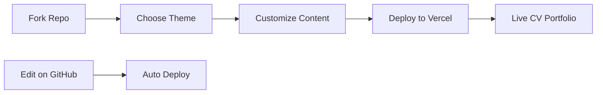

<div align="center">

# 📄 CV Portfolio Template

*Professional, modern CV/Resume portfolio with multiple design themes and styles*

[](https://vercel.com/new/clone?repository-url=https://github.com/MrShadowRIFAT/PBKLDVT-CV_Portfolio)


**Your professional story. Beautifully designed. Ready to impress.**

</div>

---

## ✨ Why This Project

Showcase your professional journey with style. Multiple premium themes for every personality. Bootstrap-powered, responsive, and ready to deploy in seconds.

---

## 🔥 Features

🎨 **8+ Design Themes** – Bootstrap 5 templates with multiple color options  
📱 **Fully Responsive** – Perfect on desktop, tablet, mobile  
✍️ **Typed Text Animation** – Dynamic typing effect available  
🎥 **Video Variants** – Media-rich CV presentations  
⚡ **Fast Loading** – Optimized performance  
🌓 **Dark & Light Modes** – Black, white, and color themes  
✏️ **Easy Customization** – Simple HTML, no build tools  

---

## 🚀 Quick Setup

### 1️⃣ Fork Repository
```bash
# Click Fork button on GitHub
# Your own copy is ready
```

### 2️⃣ Deploy with Vercel
Press the button above → Connect GitHub → Deploy (instant!)

### 3️⃣ Local Development
```bash
git clone https://github.com/YOUR_USERNAME/PBKLDVT-CV_Portfolio.git
cd PBKLDVT-CV_Portfolio
python -m http.server 8000
# Open http://localhost:8000
```

---

## 📁 Project Structure

| Folder | Purpose |
|--------|---------|
| `bootstrap5/` | Bootstrap 5 templates (recommended) |
| `bootstrap3/` | Bootstrap 3 legacy templates |
| `black_version/` | Dark professional theme |
| `white_version/` | Clean light theme |
| `color_version/` | Vibrant color theme |
| `new_dark/` | Modern dark design |
| `*_typed/` | Versions with typing animation |
| `*_video/` | Media-rich video variants |

---

## 🧠 How It Works



---

## 🛠️ Tech Stack

<div align="center">


</div>

**HTML5** • **CSS3** • **JavaScript** • **Bootstrap 5** • **Responsive Design**

---

## 📝 Customization

1. **Choose Theme** – Pick from `bootstrap5/` subdirectories
2. **Edit Content** – Update HTML with your info
3. **Add Photos** – Replace images in respective folders
4. **Customize Colors** – Modify CSS for your brand
5. **Select Style** – Use typed, video, or static versions

---

## 🎨 Available Themes

| Theme | Style | Best For |
|-------|-------|----------|
| **Black Version** | Dark & Professional | Corporate, Tech |
| **White Version** | Clean & Minimal | Creative, Design |
| **Color Version** | Vibrant & Bold | Creative Industries |
| **New Dark** | Modern & Sleek | Modern Professionals |
| **Typed** | Animation | Eye-catching |
| **Video** | Media-Rich | Multimedia Focus |

---

## 📦 Deployment

| Platform | Time | Cost |
|----------|------|------|
| **Vercel** | < 1 min | Free |
| **GitHub Pages** | 2 mins | Free |
| **Netlify** | 2 mins | Free |
| **Custom Domain** | 5 mins | Paid |

---

## 📊 GitHub Stats

<div align="center">


</div>

---

## 👨‍💼 Author

**MrShadowRIFAT** | [🔗 rifat.website](https://rifat.website) | [📧 noreply@rifat.website](mailto:noreply@rifat.website)

---

<div align="center">

**[⭐ Star This Repo](#)** • **[🐛 Report Issue](#)** • **[💡 Suggest Feature](#)**

Made with ❤️ for professionals

</div>